# Font Package Architecture Diagram

## Complete Flow: Initialization → CSS Generation

```mermaid
flowchart TD
    Start[User Code] --> Branch{Font Type?}

    %% Google Fonts Path
    Branch -->|Google Font| GF1[createGoogleFont/GoogleFontService]
    Branch -->|Local Font| LF1[localFont/LocalFontService]

    %% Google Font Flow
    GF1 --> GF2[Validate Options]
    GF2 --> GF2a[validateWeights]
    GF2 --> GF2b[validateSubsets]
    GF2 --> GF2c[validateStyles]
    GF2a --> GF3
    GF2b --> GF3
    GF2c --> GF3

    GF3[Generate Cache Key]
    GF3 --> GF4{Check Font Registry}
    GF4 -->|Exists| Return1[Return Cached FontResult]
    GF4 -->|New| GF5[Generate className & FontResult]

    GF5 --> GF6{Environment?}

    %% Build-Time Path
    GF6 -->|Build-Time| BT1[Angular CLI Builder]
    BT1 --> BT2[Font Scanner]
    BT2 --> BT3[Scan TypeScript files]
    BT3 --> BT4[Parse font declarations]
    BT4 --> BT5[loadGoogleFontBuildTime]

    BT5 --> BT6[getFontAxes]
    BT6 --> BT7[Build Google Fonts URL]
    BT7 --> BT8[fetchCSSFromGoogleFonts]
    BT8 --> BT9[HTTP Request with User-Agent]
    BT9 --> BT10[Receive CSS with @font-face]

    BT10 --> BT11[findFontFilesInCss]
    BT11 --> BT12[Parse CSS for font URLs]
    BT12 --> BT13[Extract URLs by subset]

    BT13 --> BT14[Download Font Files]
    BT14 --> BT15[fetchFontFile with retry]
    BT15 --> BT16[Save to outputPath/assets/fonts/]

    BT16 --> BT17[Generate Optimized CSS]
    BT17 --> BT18[Replace Google URLs with local paths]
    BT18 --> BT19[Add CSS variables if specified]
    BT19 --> BT20[generatePreloadLinks]

    BT20 --> BT21[Write CSS to assets/fonts.css]
    BT21 --> BT22[Write preload links to HTML]
    BT22 --> BT23[Update angular.json assets]
    BT23 --> BuildEnd[Build Complete ✅]

    %% Runtime Path
    GF6 -->|Runtime Browser| RT1[loadGoogleFontRuntime]
    RT1 --> RT2[getFontAxes from metadata]
    RT2 --> RT3[getGoogleFontsUrl]
    RT3 --> RT4[fetchCSSFromGoogleFonts]
    RT4 --> RT5[HTTP Request to Google]
    RT5 --> RT6[Receive CSS Response]

    RT6 --> RT7[findFontFilesInCss]
    RT7 --> RT8[Parse font file URLs]
    RT8 --> RT9[Determine preload files by subset]

    RT9 --> RT10[generateOptimizedCSS]
    RT10 --> RT11[Replace URLs if needed]
    RT11 --> RT12[Add CSS variable class]
    RT12 --> RT13[Add fallback fonts]

    RT13 --> RT14[injectCSS]
    RT14 --> RT15[Create style element]
    RT15 --> RT16[Set CSS ID]
    RT16 --> RT17[Append to document.head]
    RT17 --> RT18[Mark as injected in registry]
    RT18 --> Return2[Return FontResult]

    %% Local Font Flow
    LF1 --> LF2[validateLocalFontFunctionCall]
    LF2 --> LF3[Normalize src to array]
    LF3 --> LF4[Validate file paths]
    LF4 --> LF5[Get font format from extension]
    LF5 --> LF6[Generate Cache Key]

    LF6 --> LF7{Check Font Registry}
    LF7 -->|Exists| Return3[Return Cached FontResult]
    LF7 -->|New| LF8[Generate className & FontResult]

    LF8 --> LF9{Environment?}

    %% Local Build-Time
    LF9 -->|Build-Time| LBT1[loadLocalFontBuildTime]
    LBT1 --> LBT2[Create output directory]
    LBT2 --> LBT3[Copy font files to assets/fonts/local/]
    LBT3 --> LBT4[Update file paths]
    LBT4 --> LBT5[generateLocalFontCSS]

    LBT5 --> LBT6[Group sources by weight/style]
    LBT6 --> LBT7[Generate @font-face rules]
    LBT7 --> LBT8[Add custom declarations]
    LBT8 --> LBT9[Add CSS variable if specified]
    LBT9 --> LBT10[Generate preload links]
    LBT10 --> BuildEnd

    %% Local Runtime
    LF9 -->|Runtime Browser| LRT1[loadLocalFontRuntime]
    LRT1 --> LRT2[generateLocalFontCSS]
    LRT2 --> LRT3[Group by weight/style]
    LRT3 --> LRT4[Create @font-face declarations]
    LRT4 --> LRT5[Generate src with format]
    LRT5 --> LRT6[Add CSS variable class]
    LRT6 --> LRT7[injectCSS]
    LRT7 --> LRT8[Append to document.head]
    LRT8 --> Return4[Return FontResult]

    %% Common CSS Generation
    subgraph CSSGen[CSS Generation Utilities]
        CG1[generateFontFaceCSS]
        CG2[generateFontClassName]
        CG3[generateCompleteCSS]
        CG4[generatePreloadLinks]
        CG5[generateFallbackFontCSS]
    end

    %% Font Registry
    subgraph Registry[Font Registry Singleton]
        FR1[fonts Map]
        FR2[cssInjected Set]
        FR3[register]
        FR4[get]
        FR5[has]
        FR6[markCSSInjected]
    end

    style Start fill:#e1f5ff
    style BuildEnd fill:#c8e6c9
    style Return1 fill:#c8e6c9
    style Return2 fill:#c8e6c9
    style Return3 fill:#c8e6c9
    style Return4 fill:#c8e6c9
    style CSSGen fill:#fff3e0
    style Registry fill:#f3e5f5
```



## Key Components Breakdown

### 1. Entry Points (Public API)

#### Google Fonts

- **`createGoogleFont(fontFamily, options)`** - Direct font creation
- **`GoogleFontService.loadFont()`** - Angular service with signals
- **`loadGoogleFontBuildTime()`** - Build-time optimization

#### Local Fonts

- **`localFont(options)`** - Direct font creation
- **`LocalFontService.loadFont()`** - Angular service with signals
- **`loadLocalFontBuildTime()`** - Build-time optimization

### 2. Core Pipeline Stages

```
┌─────────────────────────────────────────────────────────────────┐
│                     STAGE 1: INITIALIZATION                      │
├─────────────────────────────────────────────────────────────────┤
│                                                                  │
│  User Code:                                                      │
│  ┌────────────────────────────────────────────────────────┐    │
│  │ const inter = createGoogleFont('Inter', {             │    │
│  │   weights: [400, 700],                                │    │
│  │   subsets: ['latin'],                                 │    │
│  │   variable: '--font-inter'                            │    │
│  │ });                                                    │    │
│  └────────────────────────────────────────────────────────┘    │
│                            ↓                                     │
│  Validation & Normalization:                                    │
│  • validateWeights() - Check against font metadata             │
│  • validateSubsets() - Verify available subsets                │
│  • validateStyles() - Validate normal/italic                   │
│                            ↓                                     │
│  Cache Key Generation:                                          │
│  • generateFontKey() - Create unique identifier                │
│  • Check fontRegistry for existing load                        │
│                                                                  │
└─────────────────────────────────────────────────────────────────┘
                              ↓
┌─────────────────────────────────────────────────────────────────┐
│                  STAGE 2A: BUILD-TIME PATH                      │
├─────────────────────────────────────────────────────────────────┤
│                                                                  │
│  Angular CLI Builder Execution:                                 │
│  ┌────────────────────────────────────────────────────────┐    │
│  │ 1. Font Scanner                                        │    │
│  │    • Scan src/**/*.ts for font declarations           │    │
│  │    • Parse: Inter({...}), localFont({...})           │    │
│  │    • Validate against font-data.json                  │    │
│  │                                                        │    │
│  │ 2. Font Processing                                     │    │
│  │    • For each discovered font:                        │    │
│  │      - Google: loadGoogleFontBuildTime()             │    │
│  │      - Local: loadLocalFontBuildTime()               │    │
│  └────────────────────────────────────────────────────────┘    │
│                            ↓                                     │
│  Google Font Processing:                                        │
│  ┌────────────────────────────────────────────────────────┐    │
│  │ • getFontAxes() - Build weight/style axes             │    │
│  │   Example: {wght: ['400', '700'], ital: ['0']}       │    │
│  │                                                        │    │
│  │ • getGoogleFontsUrl() - Construct API URL             │    │
│  │   https://fonts.googleapis.com/css2?family=...        │    │
│  │                                                        │    │
│  │ • fetchCSSFromGoogleFonts() - HTTP Request            │    │
│  │   User-Agent: Chrome (ensures woff2 format)           │    │
│  │   Retry: 3 attempts with 100ms delay                  │    │
│  └────────────────────────────────────────────────────────┘    │
│                            ↓                                     │
│  CSS Parsing:                                                   │
│  ┌────────────────────────────────────────────────────────┐    │
│  │ • findFontFilesInCss()                                │    │
│  │   - Parse @font-face declarations                     │    │
│  │   - Extract font URLs from src:                       │    │
│  │   - Match subset comments /* latin */                 │    │
│  │   - Determine preload based on subset                 │    │
│  └────────────────────────────────────────────────────────┘    │
│                            ↓                                     │
│  Font Download:                                                 │
│  ┌────────────────────────────────────────────────────────┐    │
│  │ • fetchFontFile() for each URL                        │    │
│  │ • Write to: dist/assets/fonts/{family}/              │    │
│  │ • File format: .woff2 (preferred)                     │    │
│  └────────────────────────────────────────────────────────┘    │
│                            ↓                                     │
│  CSS Optimization:                                              │
│  ┌────────────────────────────────────────────────────────┐    │
│  │ • Replace Google URLs with local paths                │    │
│  │   https://fonts.gstatic.com/... →                     │    │
│  │   /assets/fonts/inter/file.woff2                      │    │
│  │                                                        │    │
│  │ • Add CSS variable class if specified:                │    │
│  │   .font-inter { --font-inter: 'Inter', sans-serif; } │    │
│  │                                                        │    │
│  │ • Generate preload links:                             │    │
│  │   <link rel="preload" href="..." as="font">          │    │
│  └────────────────────────────────────────────────────────┘    │
│                            ↓                                     │
│  Output Generation:                                             │
│  ┌────────────────────────────────────────────────────────┐    │
│  │ • Write: dist/assets/fonts.css (combined CSS)         │    │
│  │ • Write: dist/assets/font-preloads.html              │    │
│  │ • Update: angular.json assets configuration          │    │
│  └────────────────────────────────────────────────────────┘    │
│                                                                  │
└─────────────────────────────────────────────────────────────────┘
                              ↓
┌─────────────────────────────────────────────────────────────────┐
│                  STAGE 2B: RUNTIME PATH                         │
├─────────────────────────────────────────────────────────────────┤
│                                                                  │
│  Browser Environment Detection:                                 │
│  • typeof window !== 'undefined' → Runtime                     │
│                            ↓                                     │
│  Runtime Font Loading:                                          │
│  ┌────────────────────────────────────────────────────────┐    │
│  │ • loadGoogleFontRuntime() / loadLocalFontRuntime()   │    │
│  │ • Async operation - non-blocking                      │    │
│  └────────────────────────────────────────────────────────┘    │
│                            ↓                                     │
│  Google Font Runtime:                                           │
│  ┌────────────────────────────────────────────────────────┐    │
│  │ • getFontAxes() - Build axes from options             │    │
│  │ • getGoogleFontsUrl() - Construct URL                 │    │
│  │ • fetch() CSS from Google Fonts API                   │    │
│  │ • findFontFilesInCss() - Extract URLs                │    │
│  │ • generateOptimizedCSS() - Prepare for injection     │    │
│  └────────────────────────────────────────────────────────┘    │
│                            ↓                                     │
│  CSS Injection:                                                 │
│  ┌────────────────────────────────────────────────────────┐    │
│  │ • generateCSSId() - Create unique ID                  │    │
│  │ • Check if already injected (by ID)                   │    │
│  │ • document.createElement('style')                     │    │
│  │ • style.textContent = css                             │    │
│  │ • document.head.appendChild(style)                    │    │
│  │ • fontRegistry.markCSSInjected()                      │    │
│  └────────────────────────────────────────────────────────┘    │
│                                                                  │
└─────────────────────────────────────────────────────────────────┘
                              ↓
┌─────────────────────────────────────────────────────────────────┐
│                     STAGE 3: CSS GENERATION                     │
├─────────────────────────────────────────────────────────────────┤
│                                                                  │
│  CSS Generator Functions:                                       │
│                                                                  │
│  generateFontFaceCSS():                                         │
│  ┌────────────────────────────────────────────────────────┐    │
│  │ @font-face {                                           │    │
│  │   font-family: 'Inter';                               │    │
│  │   font-style: normal;                                 │    │
│  │   font-weight: 400;                                   │    │
│  │   font-display: swap;                                 │    │
│  │   src: url('/assets/fonts/inter/file.woff2')         │    │
│  │        format('woff2');                               │    │
│  │   unicode-range: U+0000-00FF;  /* latin subset */    │    │
│  │ }                                                      │    │
│  └────────────────────────────────────────────────────────┘    │
│                            ↓                                     │
│  generateFontClassName():                                       │
│  ┌────────────────────────────────────────────────────────┐    │
│  │ • With variable: 'font-inter'                         │    │
│  │ • Without: '__inter_a3f9k2' (hash-based)             │    │
│  └────────────────────────────────────────────────────────┘    │
│                            ↓                                     │
│  generateCompleteCSS():                                         │
│  ┌────────────────────────────────────────────────────────┐    │
│  │ [All @font-face rules]                                │    │
│  │                                                        │    │
│  │ .font-inter {                                         │    │
│  │   --font-inter: 'Inter', system-ui, sans-serif;      │    │
│  │ }                                                      │    │
│  │                                                        │    │
│  │ /* Or without variable: */                            │    │
│  │ .__inter_a3f9k2 {                                     │    │
│  │   font-family: 'Inter', system-ui, sans-serif;       │    │
│  │ }                                                      │    │
│  └────────────────────────────────────────────────────────┘    │
│                            ↓                                     │
│  generateFallbackFontCSS() (if adjustFontFallback):           │
│  ┌────────────────────────────────────────────────────────┐    │
│  │ @font-face {                                           │    │
│  │   font-family: 'Arial';                               │    │
│  │   ascent-override: 90%;                               │    │
│  │   descent-override: 22%;                              │    │
│  │   line-gap-override: 0%;                              │    │
│  │   size-adjust: 107%;                                  │    │
│  │ }                                                      │    │
│  └────────────────────────────────────────────────────────┘    │
│                            ↓                                     │
│  generatePreloadLinks():                                        │
│  ┌────────────────────────────────────────────────────────┐    │
│  │ <link rel="preload"                                    │    │
│  │       href="/assets/fonts/inter/file.woff2"           │    │
│  │       as="font"                                        │    │
│  │       type="font/woff2"                               │    │
│  │       crossorigin="anonymous">                        │    │
│  └────────────────────────────────────────────────────────┘    │
│                                                                  │
└─────────────────────────────────────────────────────────────────┘
                              ↓
┌─────────────────────────────────────────────────────────────────┐
│                       STAGE 4: OUTPUT                           │
├─────────────────────────────────────────────────────────────────┤
│                                                                  │
│  FontResult Object:                                             │
│  ┌────────────────────────────────────────────────────────┐    │
│  │ {                                                      │    │
│  │   className: 'font-inter',                            │    │
│  │   style: {                                            │    │
│  │     fontFamily: 'Inter'                              │    │
│  │   },                                                   │    │
│  │   variable: '--font-inter'                            │    │
│  │ }                                                      │    │
│  └────────────────────────────────────────────────────────┘    │
│                            ↓                                     │
│  Usage in Angular:                                              │
│  ┌────────────────────────────────────────────────────────┐    │
│  │ // In template:                                        │    │
│  │ <div [class]="inter.className">                       │    │
│  │   Text with Inter font                                │    │
│  │ </div>                                                 │    │
│  │                                                        │    │
│  │ // Or with style:                                      │    │
│  │ <div [ngStyle]="inter.style">                         │    │
│  │   Text with Inter font                                │    │
│  │ </div>                                                 │    │
│  │                                                        │    │
│  │ // With Tailwind (using variable):                    │    │
│  │ <div class="font-[var(--font-inter)]">               │    │
│  │   Text with Inter font                                │    │
│  │ </div>                                                 │    │
│  └────────────────────────────────────────────────────────┘    │
│                                                                  │
└─────────────────────────────────────────────────────────────────┘
```

## Core Utilities

### Font Registry (Singleton)

```typescript
class FontRegistry {
  private fonts = new Map<string, FontResult>();
  private cssInjected = new Set<string>();

  // Prevents duplicate font loads
  // Tracks CSS injection status
  // Provides cache layer
}
```

**Key Methods:**

- `register()` - Store font configuration
- `get()` - Retrieve cached font
- `has()` - Check if font exists
- `markCSSInjected()` - Track DOM injection
- `isCSSInjected()` - Check injection status

### Font Metadata System

**font-data.json** contains:

- 1000+ Google Font definitions
- Available weights per font
- Supported styles (normal, italic)
- Unicode subsets (latin, cyrillic, etc.)
- Variable font axis data (wght, ital, etc.)

### Validation Layer

```
validateWeights() ──┐
                    ├──> Check against font metadata
validateSubsets() ──┤    Ensure options are supported
                    ├──> Throw errors for invalid configs
validateStyles() ───┘
```

### Fetch & Retry System

```typescript
fetchResource()
  └─> retry(fn, 3, {delay: 100})
      ├─> Attempt 1
      ├─> Wait 100ms on failure
      ├─> Attempt 2
      ├─> Wait 100ms on failure
      └─> Attempt 3
```

**Features:**

- Exponential backoff (optional)
- Configurable retry count
- Custom error messages
- User-Agent spoofing for font format selection

## Data Flow Summary

### Google Fonts Flow

```
User Code
  → createGoogleFont()
    → Validate Options
      → Check Font Registry (cache)
        → [Cache Hit] Return FontResult ✓
        → [Cache Miss] Continue ↓
          → Environment Detection
            → [Build-Time]
              → Angular Builder
                → Scan for fonts
                → Fetch CSS from Google
                → Parse & extract URLs
                → Download .woff2 files
                → Optimize & replace URLs
                → Generate CSS + preload links
                → Write to dist/
            → [Runtime]
              → Fetch CSS from Google
              → Parse font URLs
              → Generate optimized CSS
              → Inject <style> into DOM
          → Create FontResult
            → Register in cache
              → Return FontResult ✓
```

### Local Fonts Flow

```
User Code
  → localFont()
    → Validate src paths
      → Normalize to array format
        → Get font format from extension
          → Check Font Registry (cache)
            → [Cache Hit] Return FontResult ✓
            → [Cache Miss] Continue ↓
              → Environment Detection
                → [Build-Time]
                  → Copy files to dist/assets/fonts/local/
                  → Update paths to /assets/...
                  → Generate @font-face CSS
                  → Create preload links
                → [Runtime]
                  → Generate @font-face CSS
                  → Group by weight/style
                  → Inject <style> into DOM
              → Create FontResult
                → Register in cache
                  → Return FontResult ✓
```

## File Structure

```
packages/font/src/
├── public-api.ts                 # Main package exports
├── google/
│   ├── public-api.ts            # Google Fonts exports
│   ├── loader.ts                # Runtime & build-time loaders
│   ├── service.ts               # Angular service with signals
│   ├── fetch-resource.ts        # HTTP utilities with retry
│   ├── font-utils.ts            # URL builder, CSS parser
│   ├── metadata.ts              # Font validation
│   ├── font-data.json          # 1000+ Google Fonts metadata
│   └── fonts.ts                # Generated font functions
├── local/
│   ├── public-api.ts           # Local fonts exports
│   ├── loader.ts               # Runtime & build-time loaders
│   └── service.ts              # Angular service with signals
└── lib/
    ├── core/
    │   ├── types.ts            # TypeScript interfaces
    │   ├── font-loader.ts      # Font registry & utilities
    │   ├── css-generator.ts    # CSS generation functions
    │   └── retry.ts            # Retry utility
    └── builders/
        └── optimize/
            ├── index.ts        # Angular CLI builder
            ├── font-scanner.ts # TypeScript parser
            └── schema.json     # Builder configuration
```

## Key Design Patterns

### 1. **Singleton Registry Pattern**

- Prevents duplicate font loads
- Centralizes font state management
- Provides cache layer

### 2. **Factory Pattern**

- `createGoogleFont()` / `localFont()` factories
- Returns standardized `FontResult` interface
- Handles creation complexity

### 3. **Strategy Pattern**

- Build-time vs Runtime strategies
- Google vs Local font strategies
- Different optimization paths

### 4. **Builder Pattern**

- Angular CLI builder for complex build pipeline
- Step-by-step font processing
- Composable operations

### 5. **Proxy Pattern**

- Services wrap loader functions
- Add Angular-specific features (signals)
- Provide reactive interfaces

## Performance Optimizations

### Build-Time Optimizations

✅ **Download & bundle fonts** - No runtime network requests  
✅ **Self-hosting** - Faster delivery, no external dependencies  
✅ **Subset preloading** - Only load needed character sets  
✅ **Format optimization** - Serve woff2 (best compression)  
✅ **CSS inlining** - Eliminate render-blocking requests

### Runtime Optimizations

✅ **Caching** - Font registry prevents re-loading  
✅ **Deduplication** - Check by cache key before processing  
✅ **Lazy injection** - Only inject CSS when needed  
✅ **Async loading** - Non-blocking font loads  
✅ **Retry logic** - Handle network failures gracefully

### CSS Optimizations

✅ **font-display: swap** - Show fallback text immediately  
✅ **unicode-range** - Load only needed character ranges  
✅ **Fallback metrics** - Reduce layout shift (CLS)  
✅ **Preload links** - Prioritize critical fonts  
✅ **Variable fonts** - Single file for multiple weights

## Integration Points

### 1. Angular CLI Builder

- Hooks into build process
- Runs before main compilation
- Updates angular.json configuration

### 2. TypeScript Scanning

- Parses .ts files for font declarations
- Understands both function calls and constants
- Validates against font metadata

### 3. Angular Services

- Injectable services with `providedIn: 'root'`
- Signal-based reactive state
- Automatic cleanup and memory management

### 4. Tailwind CSS

- CSS variables for theme integration
- Generated class names follow conventions
- Compatible with Tailwind utilities

## Error Handling

```
Network Failures
  └─> Retry with exponential backoff (3 attempts)
      └─> Log error, continue gracefully

Invalid Font Names
  └─> Validate against font-data.json
      └─> Throw error with helpful message

Missing Font Files
  └─> Check file existence
      └─> Warn and skip (don't break build)

Malformed Options
  └─> Validate options structure
      └─> Throw error with expected format

CSS Injection Failures
  └─> Check document availability
      └─> Skip on server-side, proceed on client
```

## Environment Detection

```typescript
// Build-time detection
typeof window === 'undefined' → Build-time path

// Runtime detection
typeof window !== 'undefined' → Runtime path

// Server-side rendering
isServer() → Skip CSS injection, return FontResult only
```

---

## Example: Complete Flow for `Inter` Font

```typescript
// 1. User Code (fonts.ts)
export const inter = createGoogleFont('Inter', {
  weights: [400, 700],
  subsets: ['latin'],
  variable: '--font-inter'
});

// 2. Build Time (ng build)
// Angular Builder:
//   - Scans fonts.ts
//   - Finds: Inter({weights: [400, 700], subsets: ['latin']})
//   - Fetches: https://fonts.googleapis.com/css2?family=Inter&wght=400;700&display=swap
//   - Receives CSS with font URLs
//   - Downloads: inter-v13-latin-regular.woff2, inter-v13-latin-700.woff2
//   - Saves to: dist/assets/fonts/inter/
//   - Generates optimized CSS
//   - Writes: dist/assets/fonts.css

// 3. Generated CSS (fonts.css)
/*
@font-face {
  font-family: 'Inter';
  font-style: normal;
  font-weight: 400;
  font-display: swap;
  src: url('/assets/fonts/inter/inter-v13-latin-regular.woff2') format('woff2');
  unicode-range: U+0000-00FF;
}

@font-face {
  font-family: 'Inter';
  font-style: normal;
  font-weight: 700;
  font-display: swap;
  src: url('/assets/fonts/inter/inter-v13-latin-700.woff2') format('woff2');
  unicode-range: U+0000-00FF;
}

.font-inter {
  --font-inter: 'Inter', system-ui, sans-serif;
}
*/

// 4. Runtime (Browser)
// FontResult available immediately:
console.log(inter);
// {
//   className: 'font-inter',
//   style: { fontFamily: 'Inter' },
//   variable: '--font-inter'
// }

// 5. Usage in Template
<div [class]="inter.className">
  Text rendered in Inter font
</div>
```

---

**Legend:**

- 🔤 Font Operation
- 📁 File System Operation
- 📦 Package/Bundle Operation
- 🔄 Processing Step
- 🎨 CSS Generation
- ✅ Success/Complete
- 📄 Output File
- 🔗 Link/Reference
